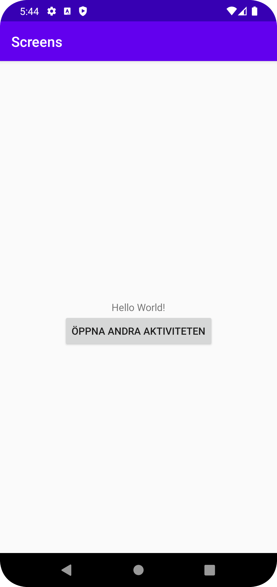

# Rapport
Inlämningen gick ut på att implementera dataöveröfrning mellan två aktiviteter. 

I MainActivity skapdes intent för att kunna starta SecondActivity med hjälp av putExtra.
Metoden las även en sträng till intent med en nyckel. Som möjligör dataöverföring.
```
    @Override
    protected void onCreate(Bundle savedInstanceState) {
        ...
         {
 public void onClick(View view) {
                Intent intent = new Intent(MainActivity.this, SecondActivity.class);
                intent.putExtra("EXTRA_MESSAGE", "DETTA ÄR FRÅN MAIN");
                startActivity(intent);
            }
```

I secondActivity hämtas meddelandet som överfördes via intent med hjälp av nyckel som skapades i Main. Därefter visas visas det i textView. 
```
protected void onCreate(Bundle savedInstanceState) {
...
       String message = getIntent().getStringExtra("EXTRA_MESSAGE");
       TextView textView = findViewById(R.id.text_view_data);
       textView.setText(message);

    }
```   

Sist så las det till en TextView widget i secondActivity layout för att visa meddelandet från mainActivity.
```
<androidx.constraintlayout.widget.ConstraintLayout
...
>

<TextView
android:id="@+id/text_view_data"
android:layout_width="wrap_content"
android:layout_height="wrap_content"
...
/>
```




